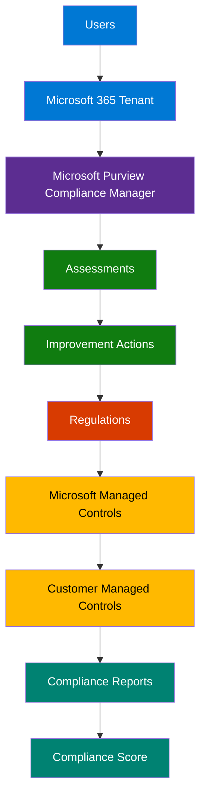
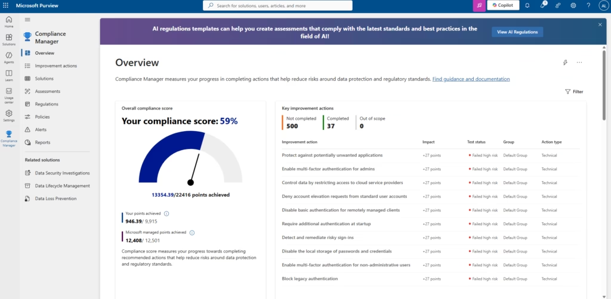
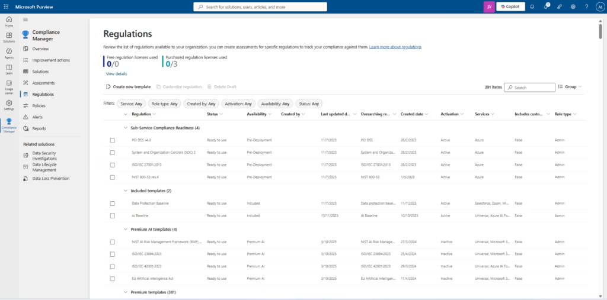
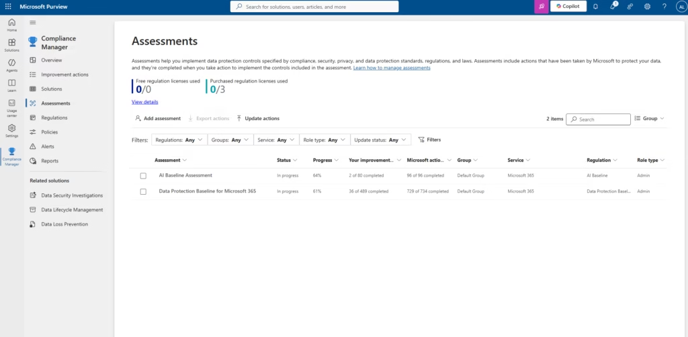
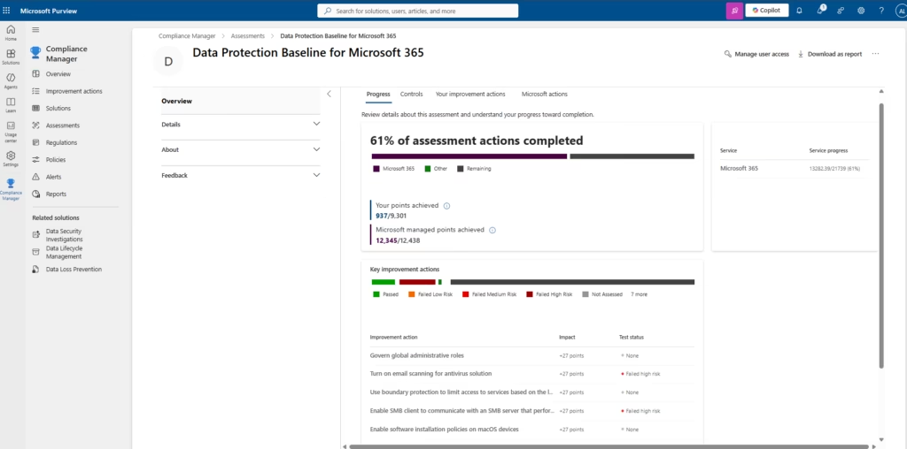
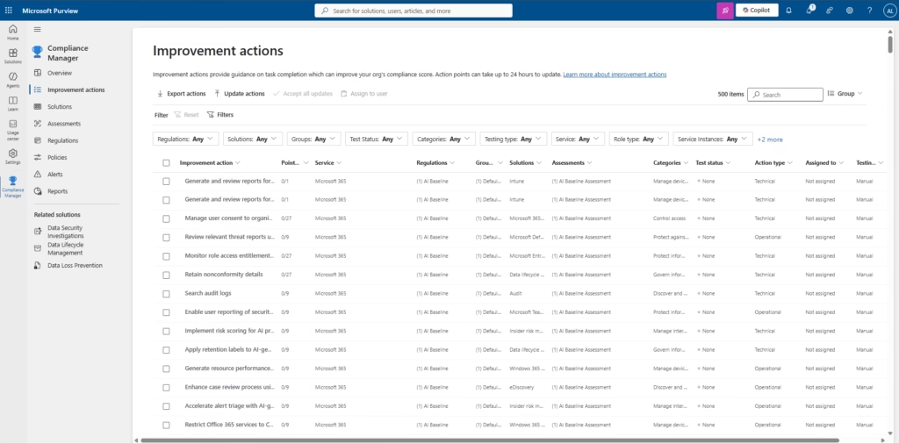
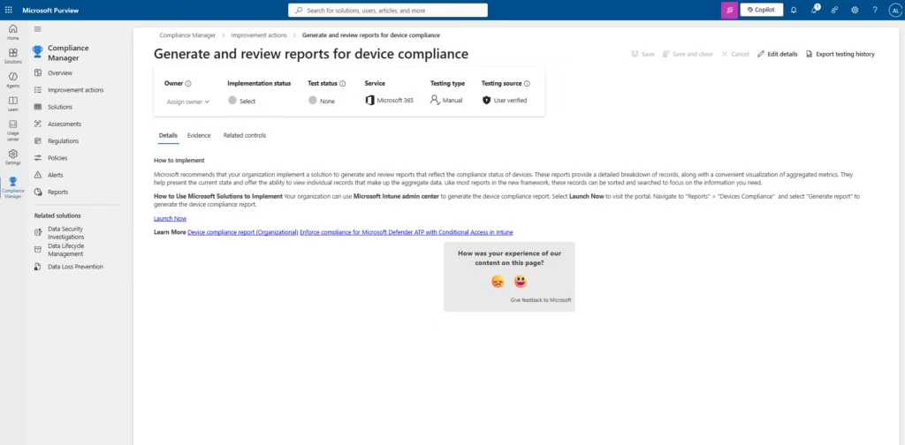
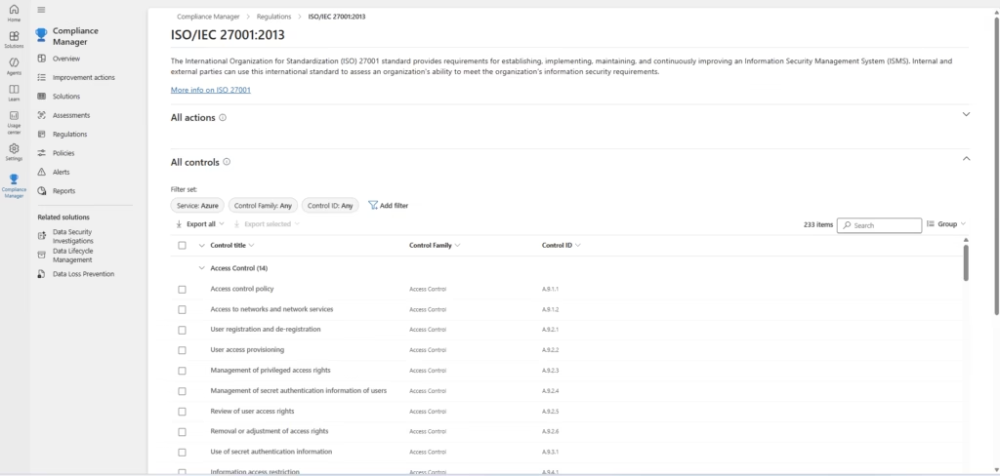
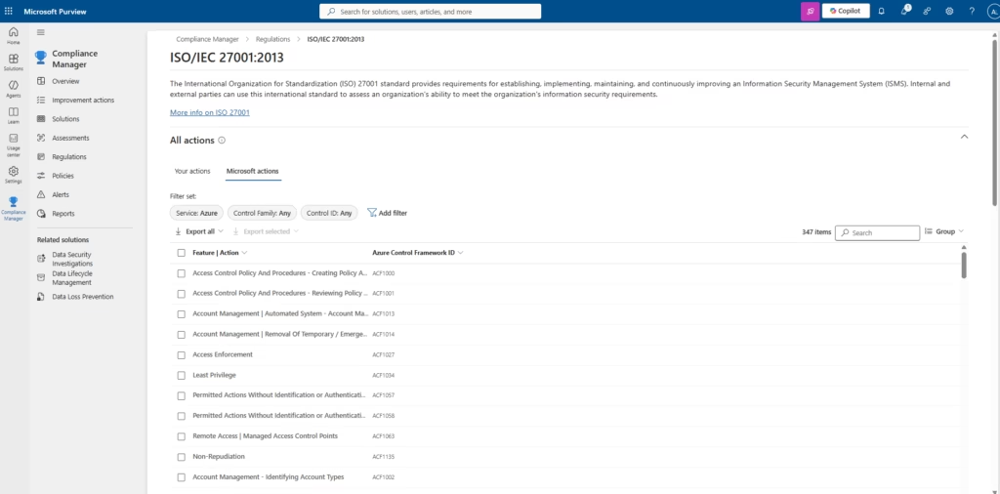

# Microsoft Purview Compliance Manager — Compliance Assessments, Improvement Actions & Regulatory Frameworks


> **Enterprise implementation project** demonstrating end-to-end deployment, configuration, and operational use of Microsoft Purview Compliance Manager across an Microsoft 365 tenant — including compliance assessments, improvement action remediation, regulatory framework mapping, ISO/IEC 27001:2013 control review, and compliance reporting.

---

## Table of Contents

1. [Project Overview](#project-overview)
2. [Business Scenario](#business-scenario)
3. [Architecture Overview](#architecture-overview)
4. [Compliance Manager Overview](#compliance-manager-overview)
5. [Compliance Score Explained](#compliance-score-explained)
6. [Regulatory Frameworks](#regulatory-frameworks)
7. [Assessments](#assessments)
8. [Improvement Actions](#improvement-actions)
9. [Microsoft Managed Controls](#microsoft-managed-controls)
10. [Customer Managed Controls](#customer-managed-controls)
11. [ISO/IEC 27001 Mapping](#isoiec-27001-mapping)
12. [Compliance Reporting](#compliance-reporting)
13. [Risk Reduction](#risk-reduction)
14. [Continuous Compliance Monitoring](#continuous-compliance-monitoring)
15. [Governance Strategy](#governance-strategy)
16. [Best Practices](#best-practices)
17. [Lessons Learned](#lessons-learned)
18. [Troubleshooting](#troubleshooting)
19. [Future Enhancements](#future-enhancements)
20. [Conclusion](#conclusion)

---

## Project Overview

This repository documents a production-style implementation of **Microsoft Purview Compliance Manager**, the risk-based compliance scoring and workflow engine embedded in the Microsoft Purview compliance portal. Compliance Manager translates regulatory, industry, and organizational requirements into a measurable, actionable program by combining three elements: **assessments** built from regulation-specific or custom templates, **improvement actions** that map to concrete technical and operational controls, and a **compliance score** that quantifies risk reduction over time.

The implementation captured in this repository reflects a tenant with an active compliance program already in flight — a starting compliance score of **59%**, two assessments in progress (**AI Baseline** and **Data Protection Baseline for Microsoft 365**), **500 improvement actions** tracked across the tenant, and **391 regulatory templates** available in the Regulations catalog, including a full **ISO/IEC 27001:2013** control mapping with 233 controls and 347 Microsoft-managed actions.

The objective of this project was not simply to enable a feature — it was to operationalize a compliance program: establishing assessments against real regulatory templates, triaging and prioritizing improvement actions by risk impact, reviewing Microsoft's shared-responsibility actions for cloud services, and producing exportable evidence suitable for internal audit and external assessor review.

### Project Goals

- Measure Microsoft 365 compliance posture using a quantifiable, point-based compliance score
- Perform compliance assessments against built-in and premium regulatory templates
- Track improvement actions from identification through remediation and testing
- Review regulatory frameworks relevant to the organization's industry and geography
- Map Microsoft-managed controls to demonstrate shared-responsibility coverage
- Evaluate ISO/IEC 27001 controls as part of ISMS readiness
- Review Microsoft actions associated with regulatory and standards frameworks
- Generate compliance reports suitable for governance, risk, and audit stakeholders
- Improve the organization's overall compliance score through prioritized remediation

---

## Business Scenario

Modern organizations operate under increasing regulatory pressure — data protection laws, industry-specific standards, national frameworks, and voluntary certifications such as ISO/IEC 27001 — often simultaneously. Manually tracking hundreds of controls across spreadsheets, SharePoint sites, and email threads does not scale, and it produces inconsistent evidence when auditors ask "prove it."

**Scenario:** A mid-to-large enterprise operating on Microsoft 365 needs a single system of record for compliance posture. The security and compliance team must:

- Demonstrate progress against the **Data Protection Baseline for Microsoft 365** and an **AI Baseline** assessment as AI-powered Microsoft 365 features are rolled out
- Prioritize remediation across **500 open improvement actions**, many of which currently show a **Failed – High Risk** test status
- Evaluate **391 available regulations** in the Compliance Manager catalog to determine which frameworks are relevant (data protection, AI governance, PCI DSS, SOC 2, NIST 800-53, ISO standards, and more)
- Prepare for an upcoming **ISO/IEC 27001:2013** certification or surveillance audit by reviewing all 233 applicable controls and the 347 Microsoft actions that support the Azure control framework
- Produce defensible, exportable reports — for example, **device compliance reporting** generated through Microsoft Intune — as audit evidence

This repository documents how Compliance Manager was configured and operated to meet that scenario, using the organization's actual assessment data, improvement action backlog, and regulation catalog as the working example throughout.

---

## Architecture Overview

Compliance Manager sits inside the Microsoft Purview compliance portal and draws its signal from Microsoft 365 workloads, Microsoft Entra ID, Microsoft Intune, Microsoft Defender, and Azure services. The logical flow from tenant configuration to a measurable compliance score is illustrated below.



**Flow description:**

| Stage | Description |
|---|---|
| **Users** | Compliance administrators, security engineers, and control owners who interact with Compliance Manager |
| **Microsoft 365 Tenant** | The tenant boundary providing identity (Microsoft Entra ID), endpoint management (Intune), threat protection (Defender), and data services (SharePoint, Exchange, Teams) |
| **Compliance Manager** | The central risk-based compliance scoring engine within the Microsoft Purview compliance portal |
| **Assessments** | Instances of a regulation or standard template applied to the tenant — e.g., Data Protection Baseline, AI Baseline |
| **Improvement Actions** | The granular technical and operational tasks that satisfy assessment controls and contribute points toward the compliance score |
| **Regulations** | The catalog of 391+ available templates spanning data protection, industry, national, and premium AI frameworks |
| **Microsoft Managed Controls** | Controls Microsoft has already implemented and tested on the organization's behalf (cloud service provider responsibility) |
| **Customer Managed Controls** | Controls that remain the customer's responsibility to configure, test, and evidence |
| **Compliance Reports** | Exportable reporting artifacts (assessment reports, device compliance reports, action evidence) used for audit and governance |
| **Compliance Score** | The aggregated, point-weighted measurement of overall compliance posture |

This shared-responsibility structure is the architectural core of Compliance Manager: Microsoft contributes a fixed set of managed points (in this tenant, **12,408 of 12,501 Microsoft-managed points achieved**), while the organization is responsible for the remaining customer-managed points (**946.39 of 9,915 achieved**), producing a combined score of **13,354.39 / 22,416 points (59%)**.

---

## Compliance Manager Overview



The **Overview** page is the landing surface for Compliance Manager and the single most important dashboard for compliance stakeholders. It answers three questions at a glance: *Where do we stand? What is Microsoft responsible for? What should we do next?*

**What the page shows in this tenant:**

- **Overall compliance score: 59%**, representing **13,354.39 of 22,416** total points achieved
- **Customer-managed points:** 946.39 of 9,915 achieved — the portion of the score directly within the organization's control
- **Microsoft-managed points:** 12,408 of 12,501 achieved — points Microsoft has already earned through its own control implementation and independent audits
- **Key improvement actions**, ranked with **500 not completed**, **37 completed**, and **0 out of scope**, each carrying a **+27 point** impact and largely showing a **Failed – high risk** test status
- A promotional banner highlighting **AI regulation templates**, reflecting Microsoft's ongoing expansion of the Regulations catalog to cover AI governance standards

**Purpose:** Give compliance leadership and control owners a single-pane view of organizational risk posture without requiring them to open individual assessments.

**Business value:** Executives and audit committees can track compliance trend over time using one number (the compliance score) instead of reconciling disparate spreadsheets. Because the score is point-weighted by risk impact, it also functions as an informal risk register — the actions at the top of the "Key improvement actions" list are, by construction, the highest-value remediation targets.

**Why administrators use it:** The Overview page is the daily/weekly working surface for a compliance administrator. It surfaces the highest-impact, unresolved actions (multi-factor authentication for admins, blocking legacy authentication, disabling local password storage) so administrators can triage without navigating through every assessment individually.

**Enterprise use case:** A CISO preparing a monthly board update pulls the compliance score trend line directly from this dashboard, while a compliance analyst uses the "Key improvement actions" table as a sprint backlog for the current remediation cycle.

**Best practices:**
- Review the Overview dashboard on a recurring cadence (weekly for active remediation programs, monthly for steady-state monitoring)
- Treat the compliance score as a *leading* indicator, not a pass/fail gate — a 59% score with a clear remediation trajectory is healthier than a stagnant 80% score
- Use the "Failed – high risk" filter as the default starting point for sprint planning
- Do not chase point totals in isolation; validate that completed actions produce a genuine security or privacy outcome, not just a scored checkbox

---

## Compliance Score Explained

Compliance Manager's score is a weighted aggregate, not a simple percentage of completed tasks. Each improvement action carries a **point value** proportional to its risk-reduction impact — in this tenant, most technical improvement actions are weighted at **+27 points**, reflecting a moderate-to-high risk-reduction contribution.

**The formula, conceptually:**

```
Compliance Score = (Points Achieved – Customer Managed) + (Points Achieved – Microsoft Managed)
                    ─────────────────────────────────────────────────────────────────────────
                                    Total Available Points (Customer + Microsoft)
```

In this implementation: **946.39 + 12,408 = 13,354.39** achieved out of **9,915 + 12,501 = 22,416** total available points, yielding **59%**.

**Why this design matters:**

- **It reflects shared responsibility.** Cloud security is a partnership; Microsoft earns points for controls it has already implemented (encryption at rest, physical datacenter security, platform-level redundancy), while the organization earns points for controls only it can configure (conditional access policies, data loss prevention rules, device compliance baselines).
- **It is risk-weighted, not task-weighted.** A control that meaningfully reduces risk (e.g., disabling legacy authentication) carries more weight than a low-impact administrative task, which keeps the score honest as a risk indicator rather than a checkbox-completion percentage.
- **It is testable.** Each action has a **test status** — Passed, Failed – High Risk, Failed – Low/Medium Risk, or Not Assessed — so the score reflects verified state, not merely "marked complete."

**Test status values observed in this tenant:**

| Test Status | Meaning | Typical Action |
|---|---|---|
| **Passed** | Control verified as implemented and effective | Monitor; include in periodic reassessment |
| **Failed – High Risk** | Control not implemented or not effective, high risk exposure | Prioritize immediately |
| **Failed – Low/Medium Risk** | Control not fully implemented, lower relative exposure | Schedule for near-term remediation |
| **Not Assessed** | No testing has occurred against the control | Assign an owner and initiate testing |

---

## Regulatory Frameworks



The **Regulations** page is the catalog from which every assessment is built. In this tenant, the catalog contains **391 items**, organized into logical groupings:

- **Sub-Service Compliance Readiness** — frameworks such as **PCI DSS v4.0**, **System and Organization Controls (SOC) 2**, **ISO/IEC 27001:2013**, and **NIST 800-53 rev.4**
- **Included templates** — templates bundled at no additional license cost, such as **Data Protection Baseline** and **AI Baseline**
- **Premium AI templates** — emerging AI governance frameworks including the **NIST AI Risk Management Framework**, **ISO/IEC 23894:2023** (AI risk management), **ISO/IEC 42001:2023** (AI management systems), and the **EU Artificial Intelligence Act**
- **Premium templates** — the remaining bulk of the catalog (381 items in this view), covering industry-specific, national, and international regulatory bodies

Each regulation entry tracks **status** (Ready to use), **availability** (Pre-Deployment, Included, Premium AI, Premium), **overarching regulation** relationships, **activation state**, and applicable **services** (Microsoft 365, Azure, and others).

**Purpose:** Provide a searchable, filterable catalog so compliance administrators can identify which regulatory templates are relevant to their organization's industry, geography, and technology footprint before committing a license to an assessment.

**Business value:** Rather than researching regulatory requirements from scratch, the organization inherits Microsoft's continuously updated mapping of control requirements to Microsoft 365 and Azure implementation guidance — collapsing months of manual control-mapping work into a template selection exercise.

**Why administrators use it:** License consumption is tracked here — this tenant shows **0 of 0 free regulation licenses** and **0 of 3 purchased regulation licenses used**, meaning three premium regulation assessments can be activated without additional procurement. Administrators use this page to plan which regulation to activate next based on upcoming audit or certification timelines.

**Enterprise use case:** A financial services compliance team filters the Regulations catalog for **PCI DSS v4.0** and **SOC 2** ahead of a payment processor renewal audit, while a healthcare organization filters for HIPAA-aligned templates before a HITRUST assessment cycle.

**Best practices:**
- Activate only the regulations genuinely applicable to the organization — over-activating consumes licenses and creates assessment sprawl
- Review the "Overarching regulation" column to understand template relationships (for example, ISO/IEC 27001:2013 appears as an overarching regulation for related sub-service templates)
- Reassess the catalog periodically; Microsoft adds new templates (particularly in the AI governance space) on an ongoing basis

---

## Assessments



An **assessment** is a regulation template activated against the tenant and populated with the improvement actions required to satisfy that regulation's controls. This tenant currently runs two active assessments:

| Assessment | Status | Progress | Your Improvement Actions | Microsoft Actions | Regulation |
|---|---|---|---|---|---|
| **AI Baseline Assessment** | In progress | 64% | 2 of 80 completed | 96 of 96 completed | AI Baseline |
| **Data Protection Baseline for Microsoft 365** | In progress | 61% | 36 of 489 completed | 729 of 734 completed | Data Protection Baseline |

**Purpose:** Assessments translate an abstract regulation into a concrete, trackable body of work scoped to the organization's tenant, group, and service configuration.

**What the page does:** It lists every active assessment with rollup progress, distinguishing between actions the organization must complete ("Your improvement actions") and actions Microsoft has already completed on the organization's behalf ("Microsoft actions"). Filters allow segmentation by regulation, group, service, role type, and update status.

**Business value:** Assessments make compliance measurable and comparable. Rather than a single undifferentiated score, the organization can see that the AI Baseline assessment (64%) is progressing faster than the Data Protection Baseline (61%), informing resourcing decisions.

**Why administrators use it:** Assessments are the unit of assignment and reporting — a compliance program manager assigns an assessment (not an individual control) to a workstream owner, then tracks that owner's contribution to the overall score through the assessment's progress bar.

### Assessment Detail — Data Protection Baseline for Microsoft 365



Drilling into the **Data Protection Baseline for Microsoft 365** assessment reveals the operational detail behind the 61% progress figure:

- **61% of assessment actions completed**, with **13,262.39 of 21,759 service points** achieved
- **937 of 9,301** customer-managed points achieved and **12,345 of 12,438** Microsoft-managed points achieved
- A **Progress / Controls / Your improvement actions / Microsoft actions** tab structure separating narrative progress from actionable control lists
- A breakdown of key improvement actions by test status: **Passed**, **Failed – Low Risk**, **Failed – Medium Risk**, **Failed – High Risk**, and **Not Assessed**
- Direct actions visible in this view include **"Govern global administrative roles," "Turn on email scanning for antivirus solution,"** and **"Enable SMB client to communicate with an SMB server that performs..."**, each worth **+27 points**

**Enterprise use case:** A data protection officer uses the assessment detail's Controls tab to trace an improvement action back to the specific regulatory control it satisfies, producing a defensible audit trail from "we did X" to "X satisfies control Y of regulation Z."

**Best practices:**
- Work assessments in priority order of risk-weighted point value, not alphabetically
- Use the **Details**, **About**, and **Feedback** side-panel sections to capture assessment-level context (scope, owner, review cadence) for governance documentation
- Export the assessment as a report ("Download as report") ahead of any audit engagement rather than relying on live portal access during the audit itself

---

## Improvement Actions



Improvement actions are the atomic unit of work in Compliance Manager. This tenant tracks **500 improvement action items**, each carrying metadata across **Point value, Service, Regulations, Group, Solutions, Assessments, Categories, Test status, Action type, Assigned to,** and **Testing type**.

**What the page does:** It provides a single, filterable, exportable register of every improvement action across every active assessment — functioning as the tenant's compliance backlog. Bulk operations are available directly from the toolbar: **Export actions, Update actions, Accept all updates, Assign to user**.

**Observed action categories** include *Manage device compliance, Protect against threats, Control access, Govern information, Discover and respond, Manage insider risk,* spanning **Technical** and **Operational** action types, with **Testing type** predominantly **Manual**.

**Purpose:** Give control owners a task-management surface purpose-built for compliance work, rather than forcing the compliance team to build one in a separate GTM or ticketing tool.

**Business value:** Centralizing 500 discrete compliance tasks in one filterable register eliminates the duplicate tracking that typically occurs when compliance work is split across spreadsheets, email, and a separate ITSM platform. The **Export actions** function feeds this data directly into GRC platforms, board reporting decks, or audit evidence packages.

**Why administrators use it:** Assignment and accountability. The **"Assigned to"** and **"Testing type"** columns let a compliance program manager distribute the 500-item backlog across a technical remediation team (Technical, Manual/Automated testing) versus a documentation/process team (Operational actions).

**Enterprise use case:** A cloud security engineering team filters the improvement actions list to `Categories: Manage device compliance` + `Test status: Failed high risk` to build a focused two-week sprint targeting Intune-managed endpoint controls.

**Best practices:**
- Group improvement actions by **Assessments** first, then by **Test status**, to avoid working the same regulation from multiple uncoordinated angles
- Use **Update actions** in bulk only after manual verification — automated bulk-accepting unverified actions inflates the compliance score without a corresponding risk-reduction outcome
- Reassess action ownership quarterly; stale "Not assigned" actions are a common audit finding

### Individual Improvement Action — Device Compliance Reporting



The **"Generate and review reports for device compliance"** action illustrates the structure of every improvement action record:

- **Owner:** Assignable via the "Assign owner" control
- **Implementation status:** Selectable dropdown (e.g., Not Implemented, Planned, Implemented)
- **Test status:** Currently **None**
- **Service:** Microsoft 365
- **Testing type:** Manual
- **Testing source:** User verified
- Tabs for **Details, Evidence,** and **Related controls**
- Explicit implementation guidance: *"Microsoft recommends that your organization implement a solution to generate and review reports that reflect the compliance status of devices... Your organization can use Microsoft Intune admin center to generate the device compliance report."*, with a direct **Launch Now** link into the Intune admin center

**Purpose:** This is where an improvement action moves from "identified" to "evidenced." The Evidence tab is where administrators attach exported reports, screenshots, or configuration exports proving the control is in place.

**Business value:** Built-in implementation guidance shortens the time between "we need to do this" and "we know exactly how to do this in our existing tooling," directly reducing time-to-remediation.

**Why administrators use it:** The **Launch Now** deep link removes navigation friction — administrators are taken directly to the Intune admin center's Device Compliance reporting feature, generate the report, and return to attach it as evidence, all within a single workflow.

**Enterprise use case:** An endpoint management team uses this exact workflow monthly to regenerate the device compliance report, ensuring the evidence attached to this improvement action never becomes stale ahead of a surprise audit request.

**Best practices:**
- Always populate **Owner** and **Implementation status** — an action without an owner cannot be meaningfully tracked to completion
- Prefer **User verified** testing sources with attached evidence over self-attestation without documentation
- Re-run evidence generation on a recurring schedule (not just once at initial completion) to keep the compliance score reflective of current-state risk, not historical risk

---

## Microsoft Managed Controls

Microsoft-managed controls are controls the cloud service provider has already implemented, tested, and (in many cases) independently audited, on behalf of every tenant using the service. In this implementation, **12,408 of 12,501 Microsoft-managed points** are already achieved tenant-wide, and within the Data Protection Baseline assessment specifically, **729 of 734 Microsoft actions are completed**.

**What they represent:** Physical datacenter security, platform-level encryption, network segmentation of the Microsoft 365 backbone, and Microsoft's own SOC 2 / ISO 27001 / FedRAMP certifications that underpin the service.

**Why they matter to the compliance score:** They demonstrate the shared-responsibility model in quantifiable terms. An assessor or auditor reviewing this tenant's compliance report can see precisely which portion of a regulation's requirements Microsoft has already satisfied through its own control environment — avoiding duplicate audit effort and streamlining third-party risk assessments of the cloud provider.

**Best practice:** Do not treat Microsoft-managed points as "free" score inflation to be ignored. Periodically review Microsoft's published audit reports (SOC 2 Type II, ISO 27001 certificates) referenced by these controls, since organizational risk management still requires validating the provider's attestations, not merely trusting the displayed percentage.

---

## Customer Managed Controls

Customer-managed controls are the organization's own responsibility — configuration, policy, and process decisions that Microsoft cannot make on the tenant's behalf. This tenant shows **946.39 of 9,915 customer-managed points achieved (~9.5%)**, the clear bottleneck in the overall 59% score.

**Representative customer-managed actions observed in this tenant:**
- Enable multi-factor authentication for admins and non-administrative users
- Disable legacy authentication and basic authentication for remotely managed clients
- Restrict access to cloud service providers and deny standard-user account elevation requests
- Detect and remediate risky sign-ins
- Govern global administrative roles
- Turn on email scanning for antivirus protection

**Purpose:** Isolate the work that is genuinely within the organization's control, so remediation planning is not diluted by controls the organization cannot influence.

**Business value:** Because customer-managed points make up the majority of unearned score (8,968.61 of 9,915 points remaining), this is where a targeted remediation program produces the fastest measurable score improvement — and, more importantly, the fastest genuine risk reduction.

**Best practices:**
- Prioritize customer-managed actions flagged **Failed – High Risk** before any Microsoft-managed review activity
- Assign customer-managed actions to the team with actual configuration authority (Identity team for MFA/Conditional Access, Endpoint team for device compliance, Security operations for sign-in risk)
- Track customer-managed point velocity separately from the blended score to avoid a false sense of progress driven by Microsoft-managed point growth

---

## ISO/IEC 27001 Mapping



Selecting **ISO/IEC 27001:2013** from the Regulations catalog opens a dedicated control-mapping view. This standard — the international requirements specification for establishing, implementing, maintaining, and continuously improving an **Information Security Management System (ISMS)** — is represented in this tenant with:

- **233 controls** under **All controls**, organized by **Control Family** (e.g., *Access Control*, containing 14 individual controls such as A.9.1.1 Access control policy, A.9.1.2 Access to networks and network services, A.9.2.1 User registration and de-registration, through A.9.4.1 Information access restriction)
- Each control carries a **Control ID** (e.g., `A.9.2.3` — Management of privileged access rights) directly traceable to the published ISO/IEC 27001:2013 Annex A control numbering

**Purpose:** Give the organization a Microsoft 365/Azure-contextualized view of every ISO/IEC 27001 Annex A control, without requiring the compliance team to manually cross-reference the published standard against Microsoft product documentation.

**Business value:** ISO/IEC 27001 certification (or surveillance audit) readiness is dramatically accelerated when every control already has a pre-populated implementation reference for Microsoft 365 and Azure — the compliance team is validating and evidencing controls, not researching how to satisfy them from a blank page.

**Why administrators use it:** The **Group by Control Family** view lets an ISMS manager work the standard in the same structure their external auditor will use, keeping internal evidence organized in a directly auditable sequence.

**Enterprise use case:** Ahead of an ISO/IEC 27001 surveillance audit, an information security manager exports the full 233-control list, cross-references each against internal policy documentation, and flags gaps for remediation before the external auditor arrives on-site.

### ISO/IEC 27001 — Microsoft Actions



The **All actions → Microsoft actions** tab under the same ISO/IEC 27001:2013 regulation reveals **347 items** — the specific Microsoft/Azure control-framework actions that satisfy the standard, each carrying an **Azure Control Framework ID** (e.g., `ACF1000` — Access Control Policy And Procedures - Creating Policy, `ACF1027` — Access Enforcement, `ACF1034` — Least Privilege, `ACF1063` — Remote Access | Managed Access Control Points).

**Purpose:** Demonstrate, at a granular technical level, exactly how Microsoft's own control implementation in Azure satisfies each ISO/IEC 27001 requirement — the evidentiary backbone an auditor expects when a cloud service is in scope for certification.

**Business value:** This mapping is frequently the difference between a straightforward audit and a prolonged one; instead of the organization explaining Microsoft's control environment from memory, the Azure Control Framework ID gives a direct, citable reference an external auditor can independently verify against Microsoft's published Azure compliance documentation.

**Best practices for ISO/IEC 27001 work in Compliance Manager:**
- Work control families in the order your Statement of Applicability (SoA) prioritizes them, not the default alphabetical listing
- Cross-reference every "Your action" against its paired Microsoft action to confirm there is no control gap between shared responsibility boundaries
- Maintain a parallel internal SoA document; Compliance Manager accelerates evidence collection but does not replace the formal ISMS documentation required by the standard

---

## Compliance Reporting

Compliance Manager supports reporting at two levels: **assessment-level reports** (exported directly from an assessment's "Download as report" action, producing a point-in-time snapshot of progress, controls, and evidence) and **action-level reports** (such as the Intune-generated **device compliance report** referenced in the "Generate and review reports for device compliance" improvement action).

**Purpose:** Convert live portal state into a static, distributable artifact suitable for stakeholders who do not have (or should not have) direct portal access — auditors, board members, and third-party risk assessors.

**Business value:** Reporting is where compliance work becomes *provable*. A dashboard score is only as credible as the evidence behind it; exported reports are what actually gets reviewed during a certification audit, a customer security questionnaire response, or a regulatory examination.

**Best practices:**
- Generate assessment reports on a fixed cadence (e.g., end of each remediation sprint) rather than only immediately before an audit, to build a historical trend record
- Store exported reports in a version-controlled evidence repository (this project's `reports/` directory models that pattern) with clear date-stamped filenames
- Pair every quantitative report (compliance score, points achieved) with the qualitative evidence (screenshots, configuration exports) that substantiates it

---

## Risk Reduction

Every improvement action's point value is a proxy for risk reduction — Compliance Manager weights actions by the security or privacy risk they mitigate, not by implementation effort. This is why the **Overview** dashboard's "Key improvement actions" list surfaces items like **multi-factor authentication for admins** and **blocking legacy authentication** at the top: these are the actions with the highest risk-reduction-per-point ratio.

**How this project applied risk-based prioritization:**
1. Filtered the 500-item improvement action backlog to **Test status: Failed – High Risk**
2. Cross-referenced high-risk actions against **customer-managed** point value (since Microsoft-managed actions require no organizational effort)
3. Sequenced remediation by **identity and access controls first** (MFA, legacy auth, privileged access), then **device compliance**, then **data protection controls**, reflecting the general principle that identity compromise is the highest-leverage attack vector in a Microsoft 365 tenant

This sequencing is consistent with Microsoft's own security guidance and with industry frameworks (e.g., CIS Controls, NIST CSF), which consistently rank identity and access management above data-layer controls in attack-path likelihood.

---

## Continuous Compliance Monitoring

Compliance is not a project with an end date — regulatory templates update, Microsoft's control environment evolves, and organizational configuration drifts. This implementation established a continuous monitoring rhythm:

- **Weekly:** Review the Overview dashboard for compliance score trend and any newly failed test statuses (configuration drift detection)
- **Bi-weekly (sprint cadence):** Work the improvement actions backlog in priority order, updating implementation status and attaching evidence
- **Monthly:** Regenerate action-level evidence reports (e.g., device compliance) to keep evidence current, not just complete
- **Quarterly:** Re-review the Regulations catalog for newly available or updated templates (particularly relevant given the pace of new AI governance frameworks such as ISO/IEC 42001:2023 and the EU AI Act)
- **Ahead of any audit:** Full export of the relevant assessment(s) and ISO/IEC 27001 control/action lists as a frozen evidence package

Improvement actions can take up to 24 hours to update their test status after a change is made, which this project's operating cadence accounted for by avoiding same-day verification of freshly implemented controls.

---

## Governance Strategy

A compliance program without governance around it degrades quickly into an unmaintained dashboard. This implementation applied the following governance model:

- **RACI by action category:** Identity team owns access-control actions, Endpoint team owns device-compliance actions, Data Governance team owns data-protection actions, Security Operations owns detection/response actions
- **Group-based scoping:** Improvement actions and assessments are filtered by **Group** (Default Group in this tenant), enabling future segmentation by business unit, subsidiary, or regulatory scope as the program matures
- **Role-based access:** Assessment and regulation role types (Admin, in this tenant) are reviewed to ensure only authorized personnel can modify assessment scope or accept bulk action updates
- **Change control on bulk actions:** "Accept all updates" and "Update actions" bulk operations are gated behind a documented review step, preventing unverified mass score inflation
- **Executive reporting cadence:** Compliance score trend is reported to leadership on a fixed schedule, independent of ad hoc audit requests

---

## Best Practices

**Microsoft recommendations:**
- Follow the in-product **"How to implement"** guidance on every improvement action before building a custom remediation approach — Microsoft's guidance is typically the fastest path and is kept current with product changes
- Use **Launch Now** deep links to jump directly into the relevant admin center (Intune, Entra, Defender) rather than navigating manually
- Review **"Learn More"** links attached to each action, which point to authoritative Microsoft Learn documentation

**Operational recommendations:**
- Maintain a single owner per improvement action; shared ownership without a named accountable individual is a leading cause of stalled remediation
- Track testing type (Manual vs. Automated) explicitly — manual testing introduces evidence staleness risk that automated testing does not

**Compliance recommendations:**
- Do not conflate "implemented" with "tested" — Compliance Manager separates **Implementation status** from **Test status** for exactly this reason
- Reassess completed actions periodically; a control that passed testing six months ago may have drifted

**Governance recommendations:**
- Establish a compliance steering committee that reviews score trend, not just point-in-time snapshots
- Formally document risk acceptance for any improvement action the organization deliberately chooses not to implement, rather than leaving it silently incomplete

**Documentation recommendations:**
- Maintain this repository's structure (`docs/`, `reports/`, `assessment-guides/`, `regulations/`, `improvement-actions/`) as a living evidence archive, version-controlled alongside the compliance program itself
- Date-stamp every exported report and screenshot to preserve an auditable historical record

---

## Enterprise Use Cases

| Industry | Representative Use Case |
|---|---|
| **Healthcare** | Map Data Protection Baseline and HIPAA-aligned regulation templates to demonstrate PHI safeguards across Microsoft 365 and Intune-managed clinical devices |
| **Financial Services** | Activate PCI DSS v4.0 and SOC 2 templates from the Regulations catalog ahead of payment processor and customer due-diligence audits |
| **Government** | Use NIST 800-53 rev.4 and FedRAMP-aligned assessments to support authorization-to-operate (ATO) packages |
| **Manufacturing** | Apply ISO/IEC 27001:2013 controls to protect intellectual property and operational technology (OT)-adjacent data stored in Microsoft 365 |
| **Education** | Leverage the AI Baseline assessment to govern the rollout of AI-powered Microsoft 365 features (e.g., Copilot) in a student-data environment |
| **Retail** | Track device compliance reporting for point-of-sale and store-operations endpoints managed through Intune |

---

## Lessons Learned

- **The compliance score is a communication tool, not the goal.** Chasing the percentage without validating genuine control implementation produces an audit that fails despite a high displayed score.
- **Customer-managed points are where the real work is.** Microsoft-managed points arrive largely "for free" via the shared-responsibility model; the organization's actual effort — and actual risk reduction — lives almost entirely in the customer-managed backlog.
- **500 improvement actions is not as overwhelming as it looks once filtered by risk.** Segmenting the backlog by test status and point value converts an unmanageable list into an ordered, workable sprint plan.
- **The Launch Now deep links save significant time** by removing the "which admin center, which menu" friction that otherwise slows remediation.
- **ISO/IEC 27001's pre-built Azure Control Framework mapping (347 actions, 233 controls) is a substantial accelerator** for certification readiness compared to manually cross-referencing the published standard against Microsoft documentation.
- **Evidence staleness is a silent risk.** A "Passed" test status from eight months ago, without recurring verification, is a weaker audit position than an honest "Not Assessed" with a scheduled test date.

---

## Troubleshooting

| Issue | Likely Cause | Resolution |
|---|---|---|
| Improvement action test status not updating after remediation | Test status updates can take up to 24 hours to process | Wait for the standard processing window before re-verifying; avoid same-day escalation |
| Assessment progress percentage lower than expected despite completed actions | Progress is point-weighted, not action-count-weighted; a few high-point actions outweigh many low-point actions | Prioritize remaining high-point, Failed – High Risk actions rather than the largest count of remaining items |
| Cannot activate a new regulation from the catalog | Regulation license (free or purchased) exhausted | Review "Free/Purchased regulation licenses used" on the Regulations page and request additional licensing if required |
| "Launch Now" link does not resolve the expected admin center feature | Role-based access control (RBAC) permissions insufficient in the target admin center | Confirm the signed-in account holds the required role (e.g., Intune Administrator) in addition to Compliance Manager access |
| Bulk "Update actions" appears to change test status unexpectedly | Bulk update applied without per-action review | Revert via action history where available; restrict bulk update permissions going forward |
| ISO/IEC 27001 control count differs from published standard | Compliance Manager's control view may reflect service-scoped filtering (e.g., `Service: Azure`) | Clear or adjust the "Service" filter to view the full unfiltered control set |

---

## Future Enhancements

- Expand assessment coverage into additional premium regulation templates relevant to upcoming certification targets (e.g., ISO/IEC 42001:2023 for AI management systems)
- Automate evidence collection for recurring improvement actions using scheduled Intune/Graph API report generation instead of manual regeneration
- Integrate Compliance Manager's exported action data with a GRC platform via the Microsoft Graph Compliance Manager APIs for unified risk-register reporting
- Build a Power BI dashboard sourced from exported improvement action data to visualize compliance score velocity over time, independent of the native portal
- Extend governance to include a formal risk-acceptance workflow for improvement actions the organization deliberately declines to implement
- Pilot Microsoft Copilot within the Purview compliance portal to accelerate control mapping and evidence summarization

---

## Conclusion

This project demonstrates a complete, operational implementation of Microsoft Purview Compliance Manager — not a feature walkthrough, but a working compliance program with real assessment data, a genuine improvement action backlog, and a defensible path from control identification to audit-ready evidence. Starting from a 59% compliance score, the documented approach — risk-based prioritization of the customer-managed backlog, disciplined use of Microsoft's shared-responsibility model, and a governance structure around ongoing monitoring and reporting — reflects the way compliance is actually operated inside a mature Microsoft 365 enterprise environment.

The combination of assessments (Data Protection Baseline, AI Baseline), a 500-item improvement action register, a 391-item regulation catalog, and a fully mapped ISO/IEC 27001:2013 control set (233 controls, 347 Microsoft actions) provides both the breadth and the depth expected of an enterprise-grade compliance function — and the documentation structure in this repository is designed to be reused as a template for any organization standing up the same capability.

---

## Repository Structure

```
.
├── README.md
├── LICENSE
├── CHANGELOG.md
├── SECURITY.md
├── CONTRIBUTING.md
├── docs/
│   └── implementation-guide.md
├── images/
│   ├── 01-compliance-manager-overview-59-percent.png
│   ├── 02-assessments-list-ai-baseline-data-protection.png
│   ├── 03-data-protection-baseline-assessment-detail.png
│   ├── 04-improvement-actions-list-500-items.png
│   ├── 05-generate-review-reports-device-compliance.png
│   ├── 06-regulations-page-391-items.png
│   ├── 07-iso-iec-27001-2013-all-controls.png
│   └── 08-iso-iec-27001-2013-microsoft-actions.png
├── reports/
│   └── README.md
├── assessment-guides/
│   ├── data-protection-baseline.md
│   └── ai-baseline.md
├── regulations/
│   └── iso-iec-27001-2013.md
├── improvement-actions/
│   └── prioritization-framework.md
└── architecture/
    └── compliance-manager-architecture.md
```

---

## Author

Documented as part of an ongoing series of enterprise Microsoft 365 security and compliance implementation projects, focused on Microsoft Purview, Microsoft Entra, Microsoft Intune, and Microsoft Defender.

## License

This project is licensed under the [MIT License](LICENSE).


## Disclaimer

Note: This repository documents a Microsoft Purview Compliance Manager implementation for educational and portfolio purposes. Microsoft, Microsoft Purview, Microsoft 365, Microsoft Intune, Microsoft Entra, Microsoft Defender, and related marks are trademarks of the Microsoft group of companies. This project is not affiliated with, endorsed by, or sponsored by Microsoft Corporation. All product screenshots are used to illustrate configuration and documentation only.
