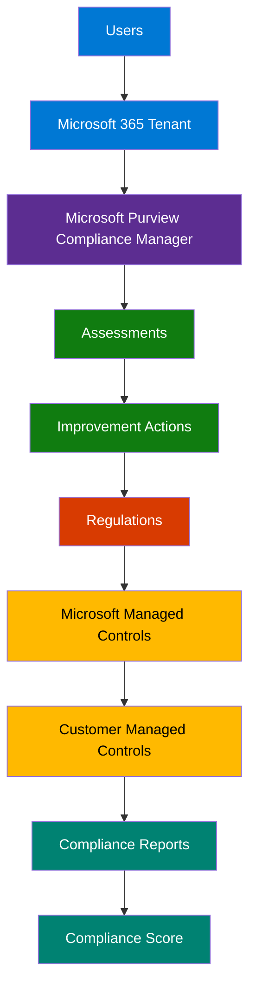
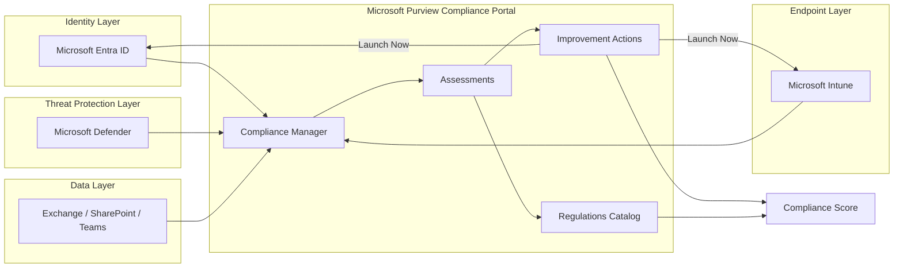
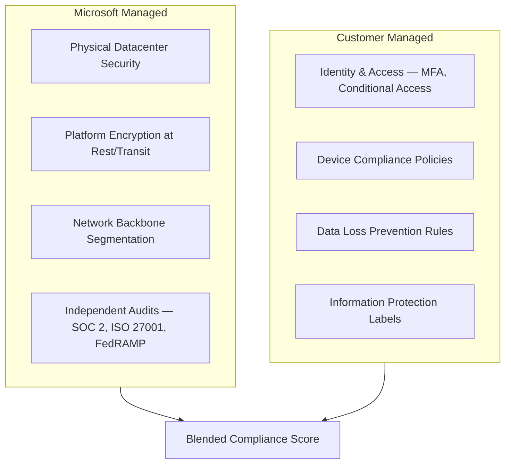

# Architecture — Microsoft Purview Compliance Manager

## High-Level Flow

## Detailed Component Interaction

## Shared Responsibility Model

## Component Descriptions

| Component | Role |
|---|---|
| **Microsoft Entra ID** | Identity provider; source for MFA, Conditional Access, privileged role, and sign-in risk signals |
| **Microsoft Intune** | Endpoint management; source for device compliance policy state and reporting |
| **Microsoft Defender** | Threat protection; source for antivirus, endpoint detection, and threat-related improvement actions |
| **Microsoft 365 workloads (Exchange, SharePoint, Teams)** | Data layer; source for data protection, DLP, and information governance signal |
| **Compliance Manager** | Central orchestration and scoring engine within the Microsoft Purview compliance portal |
| **Assessments** | Tenant-scoped instances of regulation templates, tracking progress against a defined control set |
| **Improvement Actions** | Individual, ownable, testable tasks that satisfy assessment controls |
| **Regulations Catalog** | The full library of available regulation templates (391 items in this implementation) |
| **Compliance Score** | The point-weighted aggregate measurement combining Microsoft-managed and customer-managed achievement |

## Data Flow Summary

1. Signal originates in the underlying Microsoft 365 services (Entra ID, Intune, Defender, and core workloads)
2. Compliance Manager ingests this signal to automatically test improvement actions where possible (automated testing type) or await manual verification (manual testing type)
3. Test results roll up into assessment progress, scoped to the regulation template each assessment was created from
4. Assessment progress rolls up further into the tenant-wide compliance score, split between Microsoft-managed and customer-managed point achievement
5. Reports can be generated at any level of this hierarchy — a single improvement action's evidence, a full assessment snapshot, or the overall compliance score trend — for audit and governance consumption
